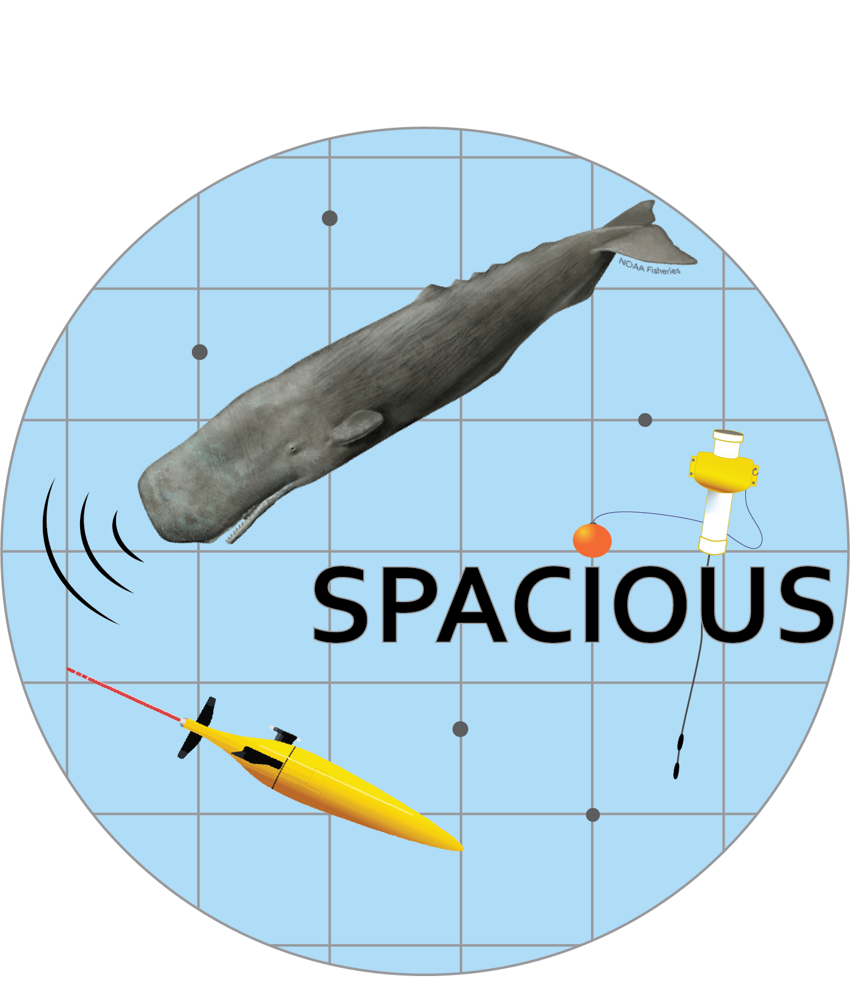
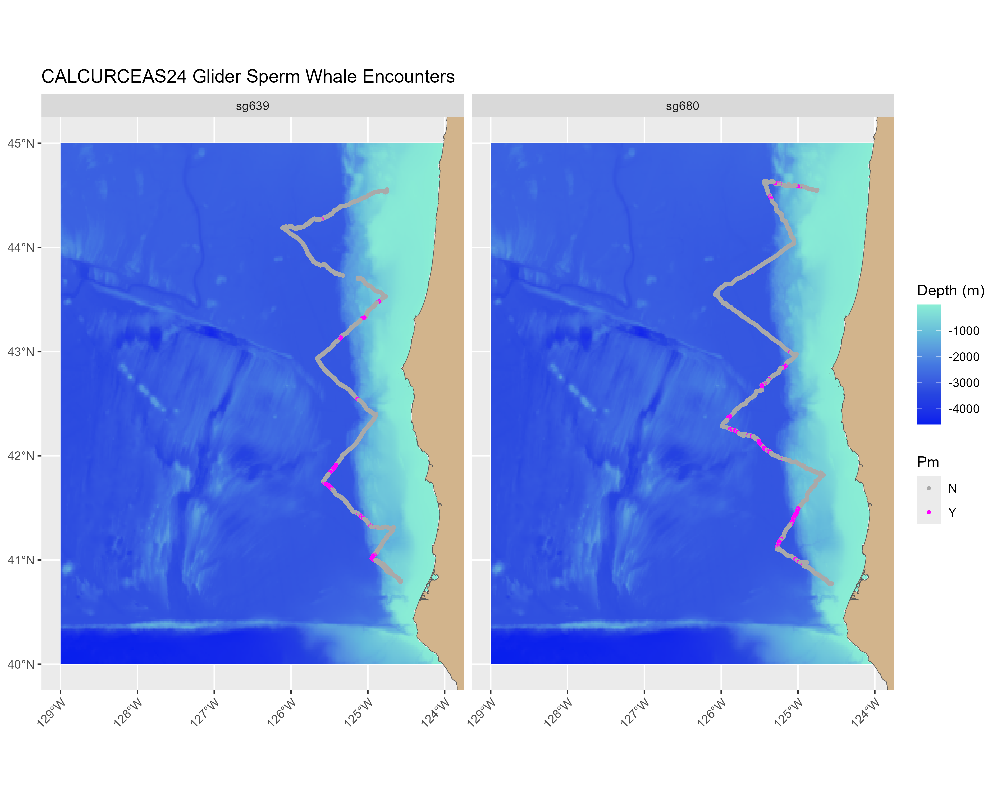
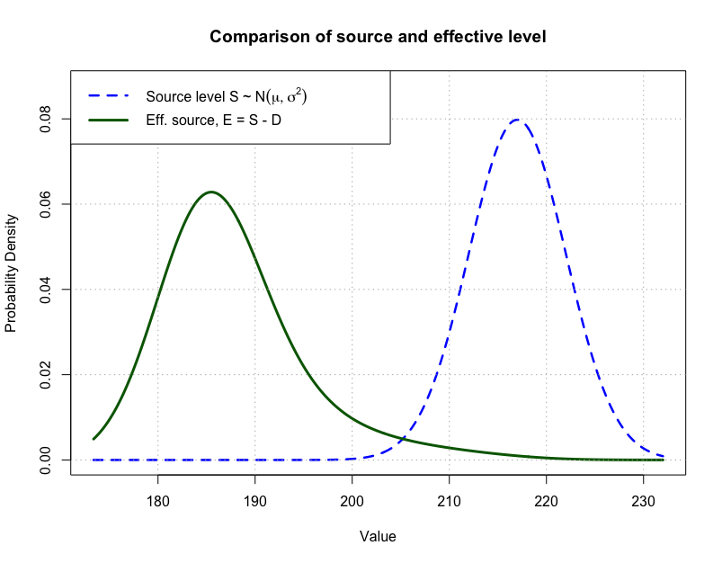
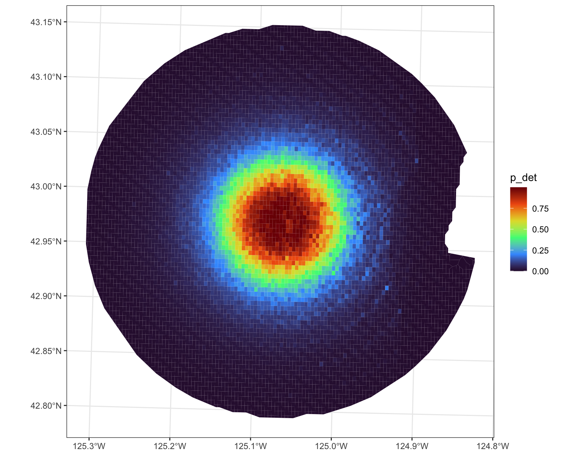

{fig-align="center" width=240}

The **SPACIOUS project** (Spatial Population Assessment of Cetaceans Integrating acoustic Observations from Uncrewed Systems) aims to develop the analytical framework necessary to integrate PAM data from slow-moving passive acoustic recorders, including underwater gliders and drifting acoustic recorders, into quantitative assessments of population distribution and density. The PAM and UxS SIs are heavily investing in the testing and development of PAM-equipped gliders and this effort will ensure that those developments are more quickly leveraged to improve cetacean assessments. This project will focus on developing a statistical framework that integrates PAM data from underwater gliders and drifters with existing visual-based species distribution models (SDM) to achieve more accurate ensemble models with seasonal context.

### **Project goals**

1. Identify aspects of spatial models and currenty density estimation methods that need modification/supplementation to incorporate slow-moving data

2. Conduct simulations and/or experiments to address missing model components

3. Develop analytical framework with an initial target species

4. Engage with the PAM glider and modelling communities to assess the state of the science and validate approaches

### **Project status**
*Last updated: June 2026*

::: {.panel-tabset}

#### Glider operations

SPACIOUS draws on two glider datasets collected as part of a Pacific-wide effort to operationalize PAM gliders for NMFS cetacean surveys. Both datasets are named for concurrent ship-based visual and acoustic surveys, enabling direct comparisons across data collection methods.

**CalCurCEAS** (California Current Cetacean and Ecosystem Assessment Survey): Two gliders surveyed the shelfbreak from Newport, OR to Eureka, CA in Fall 2024, covering ~800 km each over 6 weeks (red and yellow lines, left).

**WHICEAS** (Winter Hawaiian Islands Cetacean and Ecosystem Assessment Survey): Five gliders were deployed around the Main Hawaiian Islands from February–April 2026 for 6–12 weeks, covering up to 1,400 km each. Three will be used in SPACIOUS; SG679 (purple) is excluded due to a memory issue and the Slocum glider (green) due to platform differences.

All gliders carried identical WISPR3 recording systems sampling at 200 kHz. Gliders dove repeatedly to 1,000 m on 5–7 hour cycles, recording at all depths below 10 m — yielding near-continuous acoustic records with only ~10-minute gaps at the surface.

::: {layout-ncol=2 layout-valign="center"}
{height=300}

{height=300}
:::

#### Sperm whale detection

Following the successful completion of glider missions, raw audio files were converted to 60 to 120 second flac files for analysis. These flac files are also compressed as long-term spectral averages (LTSAs), which are used to enable analysts to visualize recordings at longer time scales. Using the MatLab-based package Triton, a trained analyst audited recordings in 15-minute LTSA viewing windows looking for odontocete signals of interest, including sperm whale clicks. When found, sperm whale click bouts were logged at the encounter-level, such that sperm whale clicks with less than 15 minutes of silence before the next click were contained within the same encounter. 

**Completed detection work**: For the two gliders deployed during CalCurCEAS2024, there were a total of 131 encounters, accounting for about 157 hours of data.
***Sperm whale presence by dive-portion***: In order to break a glider deployment into useful segments, each glider's path was broken into dive-portions (ie Dive001-decent/ascent). Sperm whale presence was graded on a binary basis based on whether any portion of a sperm whale encounter occurred during that portion. In total, there were 125 dives with at least some sperm whale click calling present.
***Manual click count analysis for detector validation***: For each dive-portion where sperm whales were present, a dozen one-minute subsamples were selected at random. For each subsample, a trained analyst manually selected individual sperm whale clicks. This resulted in a groundtruth dataset of 1500 minutes and over 300,000 clicks, which will be used to validate automated detectors used to generate click counts across the entire dataset.

**Future detection work**: Effort is currently underway to completed automated detection of clicks on CalCurCEAS2024 data and use groundtruth data to generate an adjusted click count within each dive-portion. Following the completion of glider deployments from WHICEAS2026, recording data is being processed and initial analysis for sperm whale encounters is forthcoming.

::: {layout-ncol=1 layout-valign="center"}
{height=300}
:::

#### Propagation modeling

*(Kait)*

#### Detection parameter estimation

Detection of an acoustic signal occurs when $$
R(p, s, \theta) - N >T
$$
where $N$ is the noise level, $T$ is a set threshold, and $r(p, s, \theta)$ is the received signal for an animal that emitted a click at position $p=(x,y,z)$ of nominal sound level $s$ and angle $\theta$ relative to the glider. The signal level can be decomposed as
$$
R(p,s,\theta) = s - L(p)-D(\theta),
$$
where $L(p)$ is the transmission loss from the animal at position $p$ and $D(\theta)$ is the sound level attenuation of the animal facing angle $\theta$ relative to the glider.

The *effective* sound level is defined as
$$
E(s,\theta) = s-D(\theta),
$$
and is what sound level the animal produces relative to the hydrophone on the glider.

Because $p$, $s$, and $\theta$ cannot be measured we can describe them as random variables with probability distributions, $f_P(p) = f_{X,Y}(x,y)\cdot f_Z(z)$, $f_S(s)$ and $f_\Theta(\theta)$. Note that I divided the animal location distribution into 2 parts, horizontal location $(x,y)$ and depth, $z$. So we can assess the probability of detecting a click as,
$$
\begin{aligned}
P_{cl} &= Pr\{R(P, S, \Theta)>T+N\} \\
&= {\int\int\int}_{R(p, s, \theta)>T+N} f_{P}(p)~f_S(s)~f_\Theta(\theta)~ dp~ds~d\theta.
\end{aligned}
$$

In addition we also assume there is a known distance beyond which animals will have negligible chance of being detected, say $w$. In addition to the maximum area of detection, $A = \pi w^2$, we can also reasonably assume that $f_{X,Y}(x,y) = 1/A$, i.e., a uniform horizontal distribution. Unfortunately, the same cannot be said of $f_Z(z)$ because this depends on the diving and vocalizing behavior of the whale. Now, we can begin to estimate this probability for a data set of received clicks, $r_1,\dots,r_n$.

To begin the estimation process we will develop the likelihood function for a received click. First note that given the animal's position, $p$,
$$
R(p,S,\Theta) + L(p) ~|~p = E(S,\Theta).
$$
So, we can define the likelihood for a single received click, $r$ in terms of the effective source level by conditioning, i.e.,
$$
\begin{aligned}
f_R(r) &= \int f_{R|p}(r)f_P(p) dp \\
&= \int f_{E}(r+L(p))f_P(p) dp
\end{aligned}
$$
where $f_E$ is the density function of $E(S,\Theta)$. Thus the likelihood for a single received click of level $r$ is,
$$
\mathcal{L}(r) = \frac{\int f_E(r + L(p))~f_P(p)~dp}{\int \int_{u>T+N+L(p)}f_E(u)~f_P(p)~du~dp} $$
The denominator is necessary to normalize the density function because a signal is received only if $R > T+N$ or equivalently $E > T + N + L$. One very important side note is that the probability of detecting a single click is,
$$
\begin{aligned}
P_{cl} &= \int \int_{u>T+N+L(p)}f_E(u)~f_P(p)~du~dp \\
&= \int \left[1-F_E(T+N+L(p))\right]f_P(p)~dp \\
&= \mathbb{E}_P\left[ 1-F_E(T+N+L(p))\right].
\end{aligned}
$$
where $F_E$ is the cumulative distribution function of the effective sound level distribution. So, the likelihood for a set of received click levels can be written
$$
\begin{aligned}
\mathcal{L}(r_1,\dots,r_n) &= \prod_{i=1}^n \frac{ \mathbb{E}_P \left[ f_E(r_i + L(p)\right]}{\mathbb{E}_P\left[ 1-F_E(T+N+L(p))\right]} \\
&\approx \prod_{i=1}^n \frac{ \sum_j \left[ f_E(r_i + L(p_{ij})\right]f_P(p_{ij})}{\sum_j\left[ 1-F_E(T+N+L(p_{ij}))\right]f_P(p_{ij})}
\end{aligned}
$$
where $p_{ij}$ is a grid of possible positions where $L(p_{ij})$ is evaluated via sound propagation modeling.

::: {layout-ncol=1 layout-valign="center"}
{height=300}
:::

::: {layout-ncol=1 layout-valign="center"}
{height=300}
:::

#### Density surface models

The ultimate goal of the SPACIOUS analytical framework is to translate raw acoustic detections into robust, quantitative assessments of population density and distribution. The density surface model (DSM) integrates the acoustically derived data, such as sperm whale click counts, detection probabilities, and propagation models, with environmental covariates. By adapting the statistical framework used for visual-based models to account for the unique spatial and temporal characteristics of slow-moving platforms (like gliders and drifters), this work allows researchers to predict cetacean density across a survey area. Currently, the team is building and refining these models to seamlessly incorporate uncrewed passive acoustic data, ensuring higher accuracy and seasonal context for future stock assessments.

:::

<!-- ### **Action items** -->

<!-- 1.  **Evaluate resources required:** Evaluate required funding depending on other proposals and staffing. -->

<!-- 2.  **Confer with PAM SI Working Group:** Working Group determines whether there is substantial interest and priority for continued pursuit of this project. If no-go, determine whether the project may be re-evaluated later based on funds available. -->

<!-- 3.  **Evaluate state of the science:** Connect with Center for Research into Ecological and Environmental Modelling, Duke, and other colleagues to assess the state of the science. -->

<!-- 4.  **Identify datasets and species:** Collect and collate PIFSC, SEFSC, and SWFSC PAM glider data and identify priority species for modeling based on data availability and management needs. -->

<!-- 5.  **Assess analytical next steps:** Establish a working group to assess suitable modeling frameworks that fit PAM glider data. Additionally, the PAM SI could convene a workshop or series of workshops that assess the state of the science for incorporating PAM data into species distribution model frameworks in support of this project. -->

### Team links

*\*may require NOAA Google Drive or GitHub enterprise access*

[PAM-SPACIOUS repository](https://github.com/PIFSC-Protected-Species-Division/PAM-SPACIOUS)

[Acoustic Glider Spatial Modeling Project Google Drive Folder](https://drive.google.com/drive/u/0/folders/13tSbUPhnqMJ6KupfIaAQ7_omoTFf6mBU)

[PAM-SPACIOUS Retrospective Project](https://github.com/orgs/PIFSC-Protected-Species-Division/projects/40)

##### Project update slides

[SPACIOUS March 2026 Status Update](https://docs.google.com/presentation/d/11yTZApe5wKZ4lk1MAr91hfschRlKmkazSWrFFag-hQ8/edit?usp=sharing)

[SPACIOUS March 2025 Status Update](https://docs.google.com/presentation/d/1aL-70ErgSfrShO0hvrPcnYKEC1tX26Xq_vS1F9YYBmM/edit?usp=sharing)

[SPACIOUS August 2024 PAM-SI Glider Briefing](https://docs.google.com/presentation/d/1UXxUSBQamcx3KK6Rnc_qemH0M5XTRLnNdvTPX6_i9xM/edit?usp=sharing)
